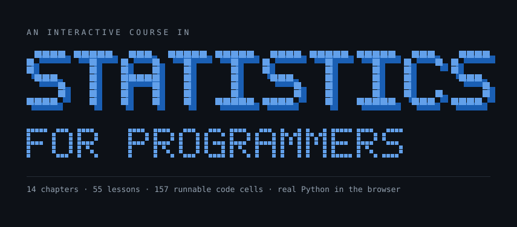

<div align="center">



<br>

**[Open the course →](https://learn-stats-for-programmers.vercel.app)**

<br>

[](https://github.com/And3m/learn-stats-for-programmers/actions/workflows/ci.yml)
[](./LICENSE)
[](https://nextjs.org)
[](https://pyodide.org)
[](https://learn-stats-for-programmers.vercel.app)

</div>

---

An interactive course in the statistics and quantitative methods programmers actually use —
probability, regression, trees, time series, optimisation, simulation, Markov chains, Benford's
law, project scheduling and statistical quality control.

**Every code block runs.** Real CPython 3.14, compiled to WebAssembly via
[Pyodide](https://pyodide.org), executes in the browser tab with NumPy, pandas, SciPy, Matplotlib,
scikit-learn, statsmodels and NetworkX available. No server, no account, nothing uploaded — the
reader can edit any cell and re-run it.

<table>
<tr>
<td align="center"><strong>14</strong><br>chapters</td>
<td align="center"><strong>55</strong><br>lessons</td>
<td align="center"><strong>157</strong><br>runnable cells</td>
<td align="center"><strong>109</strong><br>glossary terms</td>
<td align="center"><strong>83</strong><br>static pages</td>
<td align="center"><strong>64</strong><br>unit tests</td>
</tr>
</table>

---

## Running it

```bash
npm install
npm run datasets     # generate public/datasets/*.csv (deterministic, seeded)
npm run dev
```

Then open http://localhost:3000.

### Scripts

| Command | What it does |
| --- | --- |
| `npm run dev` | Development server |
| `npm run build` | Static production build (83 pages) |
| `npm run lint` | ESLint |
| `npm run typecheck` | `tsc --noEmit` |
| `npm test` | Vitest unit tests (64) |
| `npm run datasets` | Regenerate the synthetic CSVs |
| `npm run content:map` | Regenerate the MDX lesson map after adding a lesson |
| `npm run smoke:python` | Prove the Pyodide bootstrap works (11 assertions) |
| `npm run verify:python` | **Execute every code cell in the course, headlessly** |
| `npm run banner` | Regenerate the README banner at `.github/banner.svg` |

---

## Repository layout

```
src/
  app/                        Next.js App Router
    page.tsx                  Home — book cover, rail nav, chapter list
    layout.tsx                Root layout, fonts, theme provider, analytics
    globals.css               Nearly all the design system
    chapters/
      layout.tsx              Hoists one Pyodide runtime per route
      [chapter]/[lesson]/     Lesson pages, generated from content.ts
      lesson.css              Lesson-scoped styles (sidebar, prose, callouts)
      python.css              Code-cell and runtime-status styles
    glossary/ formulas/ playground/ reading/ license/

  components/
    author-links.tsx          Header profile icons + footer credit
    mobile-nav.tsx            Drawer navigation below 820px
    site-header.tsx           Brand, search, theme, author links
    article-shell.tsx         Lesson page frame: sidebar, TOC, pager
    lesson-sidebar.tsx        Chapter lesson list with progress ticks
    content/                  Callout, Quiz, SourceNote — used inside MDX
    progress/                 localStorage progress store and its UI
    python/                   Runtime provider, code cell, CodeMirror editor
    search/                   Fuse.js command palette

  content/chapters/<chapter>/<lesson>.mdx     Prose only, no frontmatter

  lib/
    content.ts                Single source of truth for the whole course
    glossary.ts               109 terms, each linked to the lesson that introduces it
    python-runtime.ts         Pyodide version pin and worker message protocol
    progress.ts               localStorage progress store
    search-index.ts           Search index built from content.ts
    *.test.ts                 Vitest suites for each of the above

public/
  pyodide-worker.js           Module worker; loads Pyodide from the CDN
  pyodide-bootstrap.py        Python-side setup, shared with the verifier
  datasets/*.csv              Eight synthetic, seeded datasets

scripts/
  verify-python.mjs           The real correctness gate — see below
  smoke-python.mjs            11 assertions on the bootstrap itself
  make-datasets.mjs           Deterministic dataset generator
  make-banner.mjs             Draws the README banner from a 5x7 bitmap font
  gen-lesson-components.mjs   Generates the static MDX import map
```

---

## Architecture

### Structure lives in TypeScript; prose lives in MDX

`src/lib/content.ts` is the single source of truth for the whole course — chapter and lesson
titles, ordering, reading times, section anchors, and which Pyodide packages and datasets each
lesson needs. Nothing globs the filesystem, and **no MDX file carries frontmatter**.

```ts
lesson(
  "normal-distribution", "3.1",
  "The normal distribution", "Normal",
  "Why the bell curve turns up everywhere…",
  "42-50", 14,
  [["shape", "Shape and parameters"], ["z-scores", "Standardising with z-scores"], …],
  { packages: ["numpy", "scipy", "matplotlib"] },
)
```

The sidebar, static params, pager, search index, glossary links and progress totals are all
projections of that one module, so they cannot drift out of sync with each other.

MDX files supply only the prose, and use raw `<h2 id="…">` tags matching the anchors declared
above. `scripts/gen-lesson-components.mjs` generates the static import map that the bundler needs.

### The Python runtime

- `public/pyodide-worker.js` — a **module** worker served as a static asset, so no bundler sits
  between the page and the runtime. It loads Pyodide from a CDN with a dynamic `import()` of
  `pyodide.mjs`.
- `public/pyodide-bootstrap.py` — the Python-side setup, loaded by both the browser worker and the
  Node verifier so the two can never diverge.
- `src/components/python/pyodide-provider.tsx` — one warm interpreter hoisted per route, shared by
  every cell on the page, exactly like a notebook.
- `src/lib/python-runtime.test.ts` — pins the worker message protocol and the module-worker
  decision, so the two halves cannot drift apart silently.

It must be a module worker. Pyodide 314 throws *"Classic web workers are not supported"*, and some
browsers block cross-origin `importScripts` outright even where a plain `fetch` of the same URL
succeeds. Dynamic `import()` avoids both.

Three further details worth knowing:

- **Nothing downloads until the reader clicks "Start Python."** Each lesson loads only the
  packages it declares — roughly 8 MB for a NumPy-only lesson, 31 MB with SciPy and Matplotlib.
- **Matplotlib figures are captured to base64 PNGs** by patching `plt.show()` and sweeping any
  figures left open. No interactive backend is involved, so this survives Pyodide version changes.
- **The site palette is injected into `matplotlib.rcParams`**, including the `axes.prop_cycle`, and
  re-applied on every run — so plots a reader generates match the page in both light and dark.

### Verification

`scripts/verify-python.mjs` is the real gate. It walks every lesson, extracts every `<PythonCell>`
from its MDX, and **executes it against the same bootstrap the browser uses**, with only that
lesson's declared packages and datasets. It also enforces three structural contracts that neither
TypeScript nor MDX can:

1. Every section anchor declared in `content.ts` exists as a heading in the MDX.
2. Every package a cell imports is declared — otherwise it would `ImportError` in the browser even
   though it passes locally, because the verifier shares one interpreter across lessons.
3. Every CSV a cell opens is declared, or it would never be mounted.

This caught a dozen real bugs while the course was being written. Run it before any content PR:

```bash
npm run verify:python                 # all 55 lessons
npm run verify:python -- time-series  # one chapter
```

CI runs lint, typecheck, test and build in one job, and `verify:python` in a second, slower one.

### Datasets

Every CSV in `public/datasets/` is synthetic and generated by `scripts/make-datasets.mjs` from a
fixed seed, so the files are byte-stable and can be regenerated at any time. Each is built with a
**known ground truth** — a true regression slope, a true log-odds model, a deliberate process shift
at a known point — so lessons can compare what a technique recovers against what is actually there.

### Design

Hand-written semantic CSS (`src/app/globals.css` plus route-scoped sheets), on a cool-neutral
palette with a plot-derived five-hue series. Those five hues are the single source of chart colour:
the SVG elements read them from CSS custom properties and the Pyodide runtime injects the same
values into Matplotlib. Tailwind is installed but essentially unused, matching the sibling project
this is modelled on.

Navigation is deliberately quiet: the header carries only search, theme and author links. Course
navigation lives in the home page rail, the lesson sidebar, and — below 820px, where both of those
are hidden — a drawer menu.

### Browser support

Anything current. The Python runtime needs module workers and WebAssembly, so it wants Chrome 80+,
Safari 15+ or Firefox 114+; the course text itself reads fine anywhere older, the code cells simply
will not start.

---

## Deployment

Static Next.js on Vercel. Every push to `main` deploys to production; pull requests get preview
URLs.

One environment variable matters:

| Name | Purpose |
| --- | --- |
| `NEXT_PUBLIC_SITE_URL` | Canonical origin for the sitemap, `robots.txt` and OpenGraph metadata |

It is read at **build** time, not runtime, so changing it needs a redeploy. It falls back to
`http://localhost:3000`. See `.env.example`.

Vercel Web Analytics and Speed Insights are wired in `src/app/layout.tsx`; both are inert off
Vercel and need enabling per-project in the dashboard.

---

## Stack

Next.js 16 (App Router, fully static) · React 19 · TypeScript · MDX with `remark-math` and
`rehype-katex` · Pyodide 314 · CodeMirror 6 · Fuse.js · next-themes · Vitest

## Attribution

The syllabus follows
[*Statistics Every Programmer Needs*](https://www.manning.com/books/statistics-every-programmer-needs)
by Gary Sutton (Manning, 2025), which is recommended as further reading and cited by page
throughout.

**The course text, code, and datasets are entirely original.** No text, figures, code listings or
data from the book are reproduced, and the book itself is not distributed with this project. See
[/license](https://learn-stats-for-programmers.vercel.app/license) for the full statement.

## Author

Created by **Vijay Andem**.

- GitHub — [@And3m](https://github.com/And3m)
- Portfolio — [vijayandem.vercel.app](https://vijayandem.vercel.app/)
- LinkedIn — [vijay-andem](https://www.linkedin.com/in/vijay-andem-b2092223/)

## License

MIT — see [LICENSE](./LICENSE).
